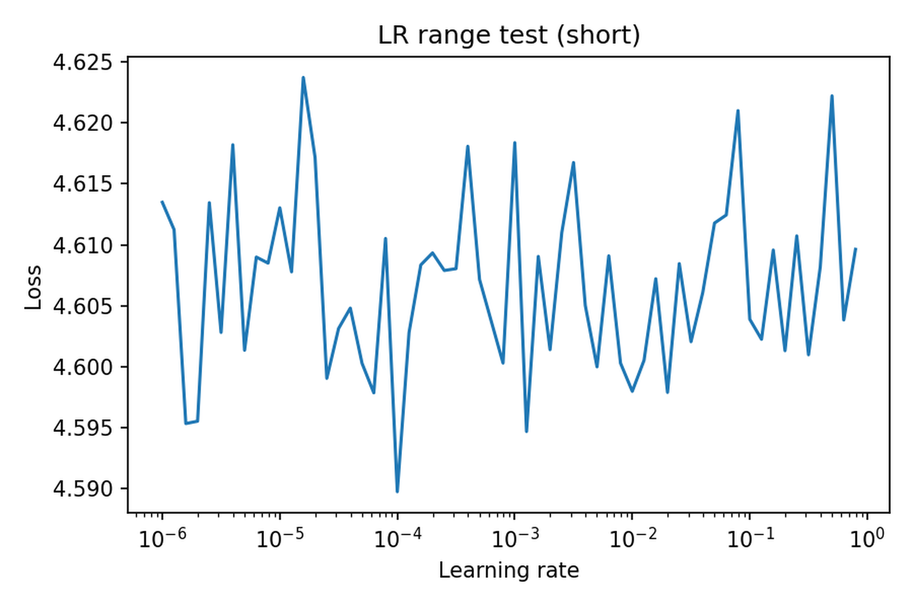

# Rascunho — Nota Técnica: EWMA, Otimizadores e Schedulers no CIFAR-100

**Resumo**
Este trabalho aplica os conceitos do Capítulo 6 (Deep Learning with PyTorch) ao dataset CIFAR‑100. Demonstramos o papel das médias móveis exponenciais (EWMA) na análise de gradientes, comparam‑se otimizadores (Adam vs SGD e variantes, incluindo Nesterov), exemplificamos testes de faixa de learning rate e mostramos visualizações de mapas de características e gradientes adaptados. Código e figuras para reprodução estão neste repositório: `notebooks/Cifar100.ipynb`.

---

## 1. Introdução

O objetivo desta nota técnica é explorar como EWMAs e otimizadores adaptativos afetam o processo de treinamento em um problema real de classificação (CIFAR‑100). Fornecemos experimentos curtos e interpretativos que suportam as escolhas usadas em aplicações práticas.

## 2. Metodologia

### 2.1 Arquitetura
- Modelo: LeNet‑like adaptado para CIFAR‑100 (arquitetura presente em `notebooks/Cifar100.ipynb`).

### 2.2 EWMA (Média Móvel Exponencial)
- Implementamos `calc_ewma` e `calc_corrected_ewma` para ilustrar suavização de sinais de gradiente e correção de viés (usada no Adam).

### 2.3 Otimizadores
- Comparações feitas:
  - Adam (β₁=0.9, β₂=0.999, ϵ padrão)
  - SGD + momentum (momentum=0.9)
  - SGD + Nesterov (momentum=0.9, nesterov=True)

### 2.4 LR Range Test e Schedulers
- Teste rápido de faixa de learning rates para localizar regimes de estabilidade.
- Exemplos curtos de `StepLR` e `ReduceLROnPlateau` para demonstrar comportamento de agendamento.

## 3. Configuração experimental (hiperparâmetros usados nos demos)

| Parâmetro | Valor (demos) |
|---|---:|
| batch_size | 128 |
| num_epochs (demos) | 3 |
| Adam lr | 1e-3 |
| SGD lr | 1e-2 |
| Momentum | 0.9 |
| β₁ | 0.9 |
| β₂ | 0.999 |
| eps (Adam) | default |
| LR range test start/end | 1e-6 / 1.0 |

> Observação: os valores acima são usados nas execuções curtas deste notebook para produção rápida de figuras. Para resultados finais aumente `num_epochs` e o número de batches.

## 4. Experimentos e Figuras

A seguir estão as figuras geradas pelo notebook, com sugestões de legenda que você pode copiar para o Medium. Os caminhos apontam para a pasta `figures/` no repositório — recomendação: ao importar para o Medium envie as imagens via upload no próprio editor.

#### Figura 1 — LR range test

**Legenda:** Resultado do LR range test (varredura rápida de learning rates). Use este gráfico para escolher a ordem de grandeza do LR inicial; o ponto onde a perda começa a decair de forma consistente indica uma boa região para o LR base.

#### Figura 2 — Adam vs SGD (demo curto)

**Legenda:** Curvas de perda (loss) de treino comparando Adam e SGD em execução curta (demonstração). Adam mostra convergência mais rápida nas iterações iniciais; avaliar a estabilidade a longo prazo exige mais épocas.

#### Figura 3 — Gradientes: brutos / EWMA / Adam-adapted

**Legenda:** Série temporal de gradientes brutos, sua suavização por EWMA (β=0.9) e os vetores adaptados calculados internamente pelo Adam. A EWMA reduz ruído e evidencia tendências; o componente adaptado mostra a reescalagem feita pelo Adam.

#### Figura 4 — Feature maps (todas as camadas)

**Legenda:** Mapas de ativação extraídos de várias camadas durante uma inferência. Útil para interpretação qualitativa — verifique padrões de ativação, saturação e resposta aos diferentes filtros.

#### Figura 5 — Scheduler examples (StepLR vs ReduceLROnPlateau)

**Legenda:** Exemplos comparativos de políticas de schedule de LR — StepLR (redução em intervalos fixos) e ReduceLROnPlateau (redução baseada em métrica de validação).

#### Figura 6 — SGD Momentum vs Nesterov

**Legenda:** Comparação entre SGD com momentum clássico e Nesterov (look-ahead). Em muitos regimes Nesterov acelera ligeiramente a convergência e fornece resposta mais previsível ao 'look-ahead'.

### Sugestão de ordem de figuras
1. LR range test (mostrar por que escolhemos LR)
2. Adam vs SGD (curvas de perda)
3. Gradientes (raw / EWMA / Adam-adapted)
4. Feature maps (insight qualitativo)
5. Scheduler examples (ilustrar políticas de redução de LR)
6. SGD vs Nesterov (comparação fina)

## 5. Interpretações (resumo curto)
- EWMA reduz ruído nos sinais de gradiente e, quando corrigida (bias-correction), aproxima estatísticas usadas por Adam.
- Adam tende a diminuir a perda mais rapidamente nas fases iniciais; SGD com momentum e Nesterov pode convergir melhor a longo prazo em alguns problemas (dependendo de LR e regularização).
- LR range test é uma ferramenta prática para selecionar uma ordem de grandeza inicial de LR.

## 6. Reprodutibilidade
- Notebook principal: `notebooks/Cifar100.ipynb` (executável, contém todas as células usadas para gerar as figuras).  
- Scripts auxiliares: `scripts/run_demo.py`, `scripts/sgd_nesterov_demo.py`.  
- Para executar localmente (virtualenv `.venv`):

```bash
source .venv/bin/activate
.venv/bin/python -m pip install -r requirements.txt
.venv/bin/jupyter lab   # abrir notebook e selecionar kernel `PyTorch Chapter6 (.venv)`
```

- Exportar HTML do notebook (para anexar ou disponibilizar offline):

```bash
.venv/bin/python -m nbconvert --to html notebooks/Cifar100.ipynb
```

## 7. Referências
- D. P. Kingma and J. Ba, "Adam: A Method for Stochastic Optimization", ICLR 2015.
- Goodfellow, Bengio, Courville — Deep Learning (capítulos relevantes).

---

## Próximos passos recomendados
- Polir legendas e parágrafos interpretativos para cada figura (eu posso gerar sugestões textuais específicas por figura).  
- Rodar experimentos completos (mais épocas) e salvar resultados finais em `figures/` para uso no artigo.  
- Incluir seção de referências formatadas e DOI/links.

Se quiser, eu já comito `article/medium_draft.md` no repositório e atualizo o `README.md` com um link para `article/`. Quer que eu adicione o arquivo agora? (responda `sim` para eu criar/confirmar e commitar)